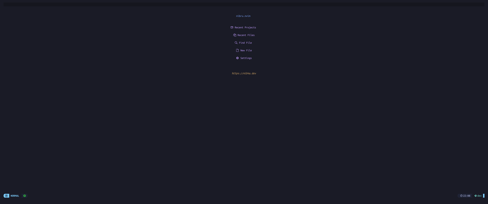
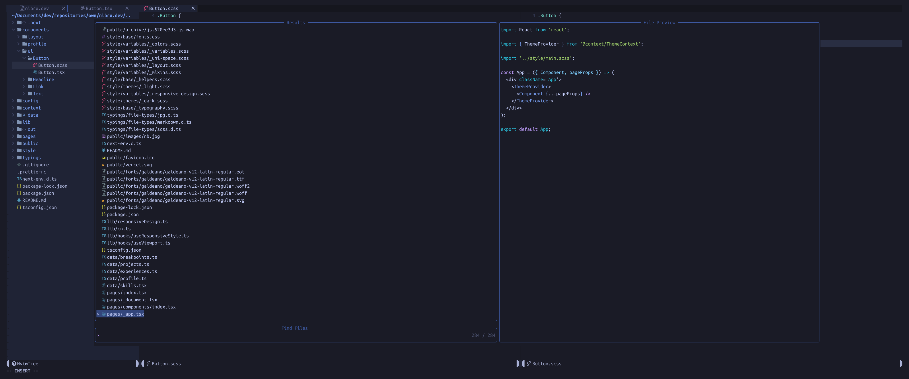
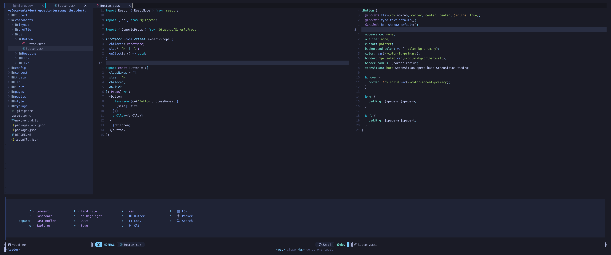
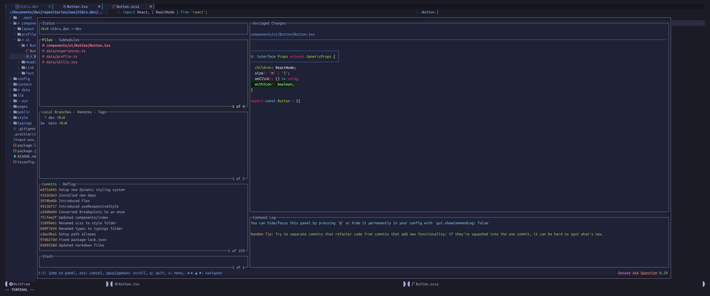

# nibru.nvim

This is my personal [NeoVim](https://neovim.io/) config on which I am working
on from time to time, while learning about the whole universe of
[NeoVim](https://neovim.io/) and [Vim](https://www.vim.org/).

This config is tailored to my personal taste and therefore not supposed to be
of general use. 

The config is based on [NeoVim](https://neovim.io/) Nightly (Version: >0.5xx)
and Treesitter for improved Syntax Highlighting, and is completely written in
[Lua](https://www.lua.org/).

## Plugins

- Packer
- Telescope
- Treesitter
- NvimTree
- Which-Key
- BarBar 
- GalaxyLine 
- Lazygit

For a full list of used plugins please see `./lua/plugins.lua`.

## Screenshots

> With `folke/tokyonight.nvim` theme.

#### Dashboard

#### Telescope

#### WhichKey

#### LazyGit

