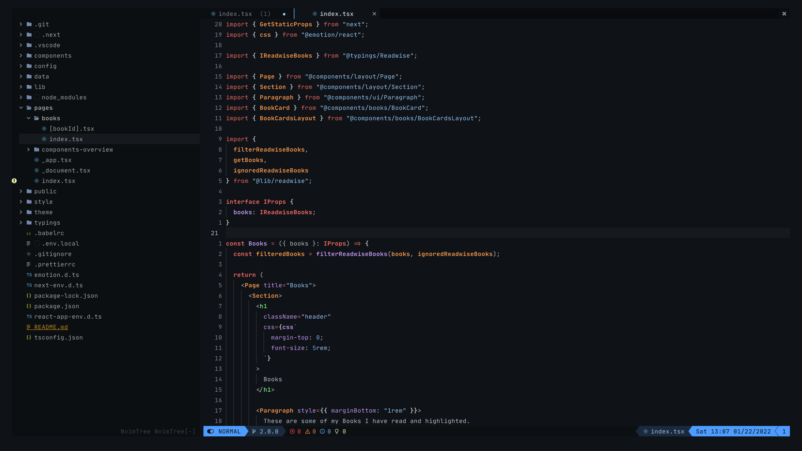
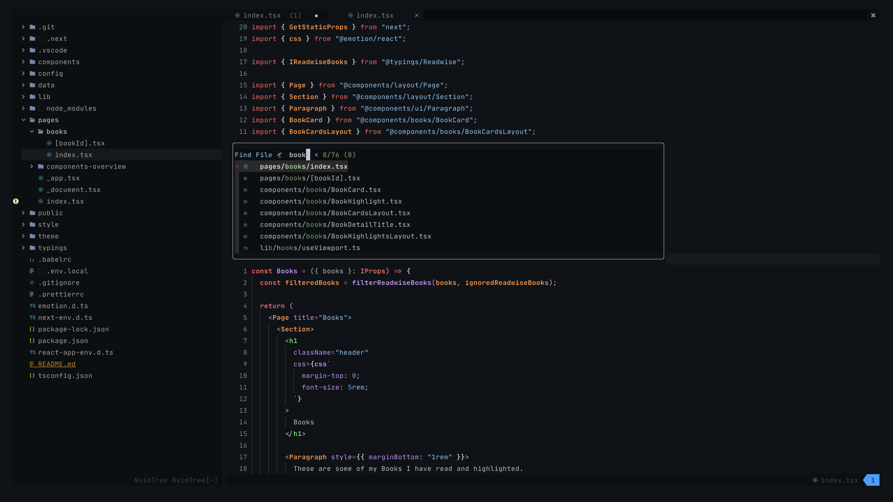
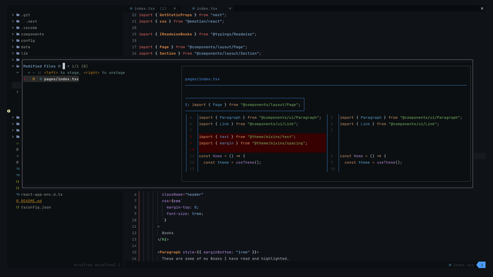

# Vin

## Description
This is my personal NeoVim configuration on which I am working on from time to time, while learning about the whole universe of Vim and NeoVim.

I tailored this config to my personal needs as a Frontend Engineer.

## Features

### Startscreen

### Pretty Colorschmes

### Semantic Mappings with WhichKey

### Fast and lag-free fuzzyfinding with `fzf-lua`

### Pretty and useful Splits

### Fast and nice looking completion

### Inline Parameter Hints

### Quickly browse modified files

### Git Interface with LazyGit

## Origin of Name

[See here](https://brandon-sanderson.fandom.com/wiki/Vin)
