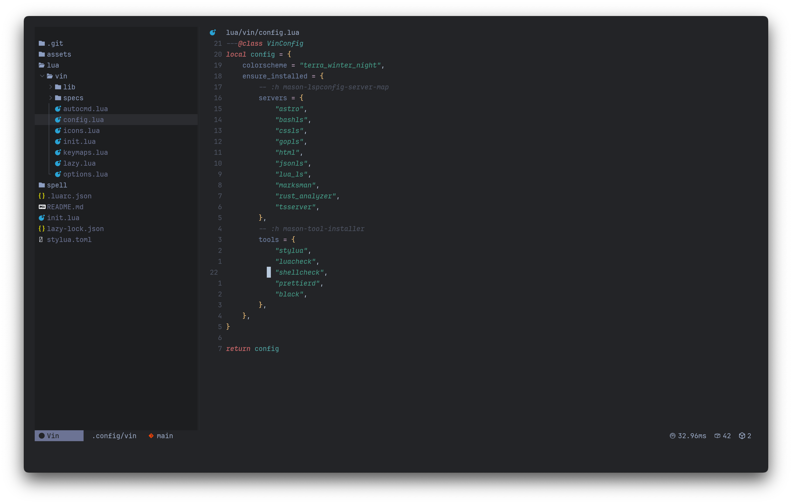

# Vin

<a href="https://dotfyle.com/nikbrunner/vin"></a>
<a href="https://dotfyle.com/nikbrunner/vin"></a>
<a href="https://dotfyle.com/nikbrunner/vin"></a>



> Vin 2.0 with [Terra Winter Night](https://github.com/black-atom-industries/black-atom.nvim) Theme and [JetBrains Mono Font](https://www.jetbrains.com/lp/mono/).

---

This is my personal Neovim configuration.

I tailored this config to my personal needs as a Frontend Engineer
mainly working with _React_, _TypeScript_ and _SCSS_.

- As fast as possible
- As simple as possible
- As few plugins as possible

## Install

> Install requires Neovim 0.9+.

Clone the repository and install the plugins:

```sh
git clone git@github.com:nikbrunner/vin ~/.config/vin
NVIM_APPNAME=vin nvim --headless +"Lazy! sync" +qa
```

Open Neovim with this config, without an alias:

```sh
NVIM_APPNAME="vin" nvim
```

If you want to start this config when running `nvim`, you can set an alias, in your `.bashrc` or `.zshrc`:

```sh
alias nvim="NVIM_APPNAME=vin nvim"
```

## Check for errors

Documentation: [Lua Language Server - Usage | Wiki](https://luals.github.io/wiki/usage/).

> Note: The `--configpath` flag seems to be broken and requires a full path.
> See here: [Settings don't seem to be applied when using linter from CLI · Issue #2038 · LuaLS/lua-language-server](https://github.com/LuaLS/lua-language-server/issues/2038)

```sh
lua-language-server --check ./lua --logpath=. --configpath=/Users/nikolausbrunner/.config/nvim/.luarc.json
```

## Uninstall

To remove everything related to this config, run the following commands:

```sh
rm -rf ~/.config/vin
rm -rf ~/.local/share/vin
```

Make sure you have [a nerd font](https://github.com/ryanoasis/nerd-fonts) installed.

## Origin of Name

[See here](https://brandon-sanderson.fandom.com/wiki/vin)

## Obsidian

I have a `.vimrc` config for my Obsidian Notes.
To have a backup, a SSOT and standalone capabilities, I have a little script, which copies the `.obsidian.vimrc` to the Note folders.

```sh
sh ./obsidian/sync.sh
```

## TODO

- [ ] Improve mapping structure & fix inconsitencies
    - Group mappings by ..
      - Scope ? (e.g. [W]orkspace & [F]ile)
      - Frequency
    - Inconsistencies: For code actions I sometimes use leader, and sometimes not (see rename)

## Links

### General

- [EmmyLua Documentation - Formatting Annotations · sumneko/lua-language-server Wiki](https://github.com/sumneko/lua-language-server/wiki/Formatting-Annotations)
- [Help - Neovim docs](https://neovim.io/doc/user/index.html)

### Other Configs

- [dotfiles/.config/nvim at mac · MariaSolOs/dotfiles](https://github.com/MariaSolOs/dotfiles/tree/mac/.config/nvim)
- [0xsamrath/.dotfiles](https://github.com/0xsamrath/.dotfiles)
- [LunarVim/nvim-basic-ide](https://github.com/LunarVim/nvim-basic-ide)
- [dot/nvim · folke/dot](https://github.com/folke/dot/tree/master/nvim)
- [folke/LazyVim: Starter template for lazy Neovim users](https://github.com/folke/LazyVim)
- [cseickel/dotfiles](https://github.com/cseickel/dotfiles/blob/main/config/nvim/lua/status.lua)
- [ahmedelgabri/dotfiles](https://github.com/ahmedelgabri/dotfiles/blob/c2e2e3718e769020f1468048e33e60ad8a97edfc/config/.vim/lua/_/lsp.lua#L329-L378)
- [glepnir/nvim](https://github.com/glepnir/nvim)
- [craftzdog](https://github.com/craftzdog/dotfiles-public/tree/master/.config/nvim)
- [harrisoncramer/nvim: My personal Neovim configuration.](https://github.com/harrisoncramer/nvim/tree/main)
- [GitHub - alex35mil/dotfiles: My dotfiles](https://github.com/alex35mil/dotfiles)
- [loctvl842/nvim](https://github.com/loctvl842/nvim?search=1)
- [JoosepAlviste/dotfiles](https://github.com/joosepalviste/dotfiles/)

> This readme was partially generated by [Dotfyle](https://dotfyle.com/nikbrunner/vin).
