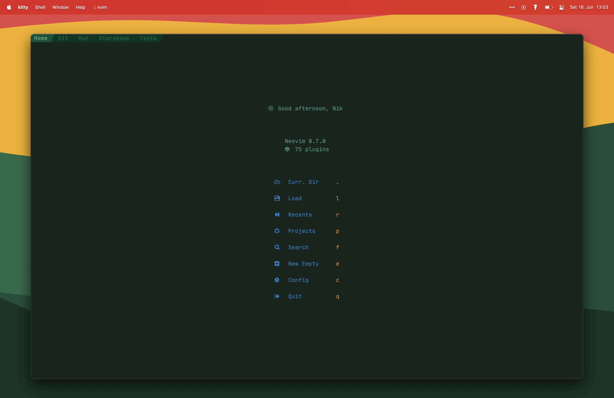

# Vin

## Description
This is my personal NeoVim configuration on which I am working on from time to time, while learning about the whole universe of Vim and NeoVim.

I tailored this config to my personal needs as a Frontend Engineer.

## Screenshots



## Theme

[Terra](https://github.com/terra-theme)

## Install Neovim

### Install Script

```sh
curl -sLf https://raw.githubusercontent.com/nikbrunner/vin/install.sh | sh
```

### Manual steps
#### Install Neovim with Homebrew on Mac

Stable Version

```sh
brew install neovim
```

Last Version

```sh
brew install neovim --HEAD
```

#### Install Neovim 0.7 from Source

You can install Neovim with your package manager e.g. brew, apt, pacman etc.. but remember that when you update your packages Neovim may be upgraded to a newer version.

If you would like to make sure Neovim only updates when you want it to than I recommend installing from source:

```sh
git clone https://github.com/neovim/neovim.git
cd neovim
git checkout release-0.7
make CMAKE_BUILD_TYPE=Release
sudo make install
```

## Install Config

Make sure to remove or move your current `nvim` directory

```
git clone git@github.com:nikbrunner/vin.git ~/.config/nvim
```

Run `nvim` and wait for the plugins to be installed 

**NOTE:** (You will notice treesitter pulling in a bunch of parsers the next time you open Neovim) 


each video will be associated with a branch so checkout the one you are interested in

## Get healthy

Open `nvim` and enter the following:

```
:checkhealth
```

You'll probably notice you don't have support for copy/paste also that python and node haven't been setup

So let's fix that

First we'll fix copy/paste

- On mac `pbcopy` should be builtin

- On Ubuntu

  ```
  sudo apt install xsel
  ```

- On Arch Linux

  ```
  sudo pacman -S xsel
  ```

Next we need to install python support (node is optional)

- Neovim python support

  ```
  pip install pynvim
  ```

- Neovim node support

  ```
  npm i -g neovim
  ```

## Fonts

- [A nerd font](https://github.com/ryanoasis/nerd-fonts)
- [codicon](https://github.com/microsoft/vscode-codicons/raw/main/dist/codicon.ttf)
- [An emoji font](https://github.com/googlefonts/noto-emoji/blob/main/fonts/NotoColorEmoji.ttf)

After moving fonts to `~/.local/share/fonts/`

Run: `$ fc-cache -f -v`

**NOTE:** (If you are seeing boxes without icons, try changing this line from `false` to `true`: [link](https://github.com/ChristianChiarulli/nvim/blob/ac41efa237caf3a498077df19a3f31ca4b35caf3/lua/user/icons.lua#L5))


## Wallpaper


## Origin of Name

[See here](https://brandon-sanderson.fandom.com/wiki/Vin)

## Other Configs

- [0xsamrath/.dotfiles](https://github.com/0xsamrath/.dotfiles)
- [LunarVim/nvim-basic-ide](https://github.com/LunarVim/nvim-basic-ide)
- [folke/dot/nvim](https://github.com/folke/dot/tree/master/config/nvim/lua)
- [cseickel/dotfiles](https://github.com/cseickel/dotfiles/blob/main/config/nvim/lua/status.lua)
- [ahmedelgabri/dotfiles](https://github.com/ahmedelgabri/dotfiles/blob/c2e2e3718e769020f1468048e33e60ad8a97edfc/config/.vim/lua/_/lsp.lua#L329-L378)
